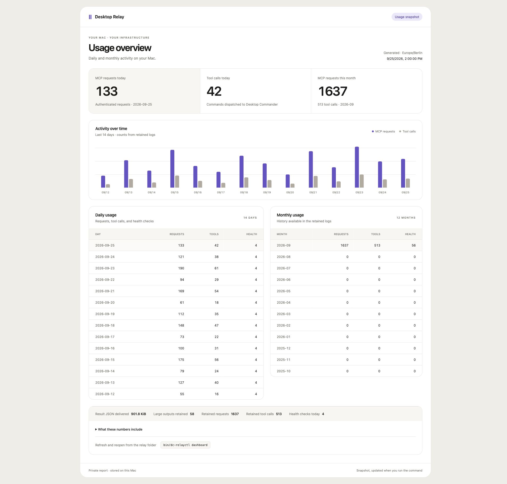

# desktop-relay

Self-hosted replacement for the paid [Desktop Commander Remote MCP](https://mcp.desktopcommander.app)
relay. Run [Desktop Commander MCP](https://github.com/wonderwhy-er/desktopcommandermcp)
on your own machine behind your own authenticated HTTPS endpoint, with no monthly
tool-call quota.



*Dashboard preview using sample data.*

## Architecture

```
remote MCP client
  -> https://<your-edge>/mcp               TLS at the edge
  -> tunnel agent on your Mac              Cloudflare named tunnel
  -> 127.0.0.1:8788  src/daemon.ts         auth + limits + audit
       |-- one SDK Server + transport per client session   (session.ts)
       |-- policy-checked tools and advertised UI resources (session.ts)
       |-- one SDK Client + one desktop-commander child    (upstream.ts)
  -> desktop-commander (stdio child)       the OSS MCP server
```

The relay **terminates** each downstream MCP connection: every remote client gets its
own protocol session (capabilities, cancellation, progress ownership), while all
sessions share one long-lived desktop-commander child — the "one device" semantic the
vendor relay provides. Only the relay's own SDK Client ever initializes the child.

Node 24 runs the TypeScript directly (native type stripping). Runtime deps:
`@modelcontextprotocol/sdk@1.30.0` + `@wonderwhy-er/desktop-commander@0.2.51`, both
exact-pinned.

## Install with Cloudflare

Requires macOS, Node 24, `cloudflared`, and a domain managed by Cloudflare.
Use your own hostname in place of `dc.khalifah.uk` for another installation.

```bash
git clone git@github.com:HashemKhalifa/desktop-relay.git
cd desktop-relay
npm ci
```

On the Mac, log in to Cloudflare and create the tunnel and DNS route once:

```bash
cloudflared tunnel login
cloudflared tunnel create desktop-relay
cloudflared tunnel route dns desktop-relay dc.khalifah.uk
```

Put the tunnel UUID returned by `create` into `~/.cloudflared/config.yml`:

```yaml
tunnel: <UUID>
credentials-file: /Users/<mac-user>/.cloudflared/<UUID>.json
ingress:
  - hostname: dc.khalifah.uk
    service: http://127.0.0.1:8788
  - service: http_status:404
```

Keep the certificate, tunnel credentials, and config under `~/.cloudflared`, outside
the repo. Then validate and install the launch agents:

```bash
cloudflared tunnel ingress validate
./install.sh --edge cloudflare --domain dc.khalifah.uk
scripts/verify.sh https://dc.khalifah.uk
bin/dc-relayctl doctor
```

The daemon and tunnel run as macOS LaunchAgents after login. Both restart on failure;
the daemon listens only on `127.0.0.1:8788`. The hostname above is this installation's
public endpoint; use your own hostname for another installation.

## Using it

Bearer clients (Codex, Claude connectors — header-capable):

```
url:     https://<edge>/mcp
header:  Authorization: Bearer <secret from mint>
```

Header-less clients get a `path-only` credential — the URL path itself is the secret:

```bash
bin/dc-relayctl mint --name phone --kind path-only --tools all
# -> https://<edge>/<pathToken>/mcp
```

### ChatGPT

This installation is already connected in ChatGPT as **Desktop Relay**. In a new
chat, click **+** in the composer, choose **Desktop Relay**, and ask it to use that
app. The paid **Remote Desktop Commander** app is separate; choose **Desktop Relay**
for the self-hosted connection.

To set up another ChatGPT account or replace a revoked credential:

1. Run `bin/dc-relayctl mint --name chatgpt --kind path-only --tools all` on the Mac.
   Save the returned secret privately; it is displayed only when minted.
2. In ChatGPT, open **Customize → Plugins → Add → Create MCP App**. Name it **Desktop
   Relay**. Set **Server URL** to `https://dc.khalifah.uk/<pathToken>/mcp` and
   **Authentication** to **No authentication**. The path token authenticates the
   request; treat the complete URL as a secret. Confirm the access warning, create
   the app, and connect it.
3. Start a fresh chat, select **Desktop Relay** from **+**, and try a harmless tool
   call. Keep the paid app until this real-client check succeeds.

ChatGPT's MCP App form used here did not offer a custom authorization header, so the
path-only credential is required for this setup. Never paste the token into a chat,
issue, log, or repository file.

The relay exposes Desktop Commander's structured tool arguments directly; a device
ID is unnecessary because this endpoint targets one Mac. Compact descriptions in
`src/tool-descriptions.ts` cover the pinned upstream tools; their argument schemas,
risk annotations, and UI metadata remain intact. Unrecognized tools retain their
upstream description. ChatGPT still controls
action approvals, and its saved tool definitions may need refreshing after an update.

### After a Mac or daemon restart

After logging in to macOS, the launch agents start the daemon and Cloudflare tunnel.
The existing ChatGPT app and path credential remain configured; select **Desktop
Relay** in a new chat and use it normally. An MCP session interrupted by a restart
must initialize again. If a tool call was interrupted, its outcome may be unknown:
check its effect before deciding whether to issue a new call.

If ChatGPT cannot connect, check the live service and tunnel:

```bash
bin/dc-relayctl status
bin/dc-relayctl doctor
cloudflared tunnel info desktop-relay
scripts/verify.sh https://dc.khalifah.uk
```

`doctor` should show `127.0.0.1:8788` listening and no LAN listener. If the daemon
is stopped, run `bin/dc-relayctl restart`; if the Mac is asleep, offline, or logged
out, the public endpoint may be unavailable until it wakes and the user logs in.

Idle MCP sessions expire after 15 minutes. At the 300-session default limit, the relay can
reclaim the oldest session idle for at least one minute; in-flight requests are
preserved. A client whose session expires must initialize again. This cleanup does
not restart Desktop Commander or rerun commands.

### Local usage dashboard

Run `bin/dc-relayctl dashboard` on the Mac to open the live local dashboard.
The daemon serves it at `http://127.0.0.1:8789` (configurable with `dashboardPort`).
It loads usage and daemon status immediately when opened or reloaded, refreshes
when you return to the tab, and polls every ten seconds while visible. It starts
with the daemon after login. The CLI opens it with
a temporary URL fragment that the page exchanges for an HttpOnly cookie and removes
from the address bar. The key stays in `~/.config/desktop-relay/dashboard.key`.
It shows authenticated MCP request counts, tool calls, and health checks for today,
this month, the last 14 days, and the last 12 months. `--no-open` exports a standalone
snapshot to
`~/.config/desktop-relay/dashboard.html`.

The report is generated from the metadata-only audit file and its previous rotated
file. Tool-call history already in the audit is included; request counts begin with
the request-audit event added alongside this dashboard. Older HTTP requests cannot
be backfilled, and the relay cannot count ChatGPT tokens or model costs. The report
stays on the Mac and is not served by the public tunnel.

The overview includes a 14-day activity chart and daily/monthly ledgers. To change
the palette, spacing, or typography, edit `src/dashboard.css`; the `:root` variables
define the colors. Styles are scoped under `.relay` and embedded in the generated
HTML, so the report remains a single file with no build step or external assets.
Result bytes measure JSON traffic, including retained-result page reads, not model
tokens.

### Large tool results and context

Plain-text results above 16 KiB return a short preview and a result ID. Use
`read_relay_result` with that ID, `contentIndex` (default 0), and `offset` (default 0)
to retrieve up to 12 KiB of exact UTF-8 text per page. Follow `nextOffset` until null,
then increment `contentIndex` to read any remaining text blocks. This reads the
original stored output; it never reruns the command.

Results are scoped to the original principal and source-tool grant, including
across new MCP sessions. They expire after one hour, may be evicted earlier under
memory pressure, and disappear on daemon restart. The cache is 64 MiB total with
a 32 MiB per-principal limit. Revocation clears that principal's retained results.
An unavailable result does not establish that the original command failed.

Small results, media, structured/schema-bound results, annotated text, widget-origin
calls, and results larger than the per-principal cache limit preserve their native
responses. These exceptions can still be large. Audit events record byte counts
and whether a result was offloaded, without recording its contents.

After updating, refresh Desktop Relay's tool definitions in ChatGPT so it discovers
`read_relay_result`. This reduces large responses added to future turns; it does not
shrink existing chat history or change ChatGPT's conversation limits.

Run `node scripts/verify-context.ts https://dc.khalifah.uk` to check exact output
recovery, principal isolation, revocation, and one-time command execution against
the public endpoint. Use your own hostname on another installation.

## Update an existing installation

Wait for active tool calls and terminal jobs to finish before restarting. From the
repository directory:

```bash
git pull --ff-only
npm ci
bin/dc-relayctl restart
bin/dc-relayctl doctor
```

The restart loads the new daemon code and dashboard assets. It also clears MCP
sessions, terminal output tracking, and retained results; save needed output first.
Your credentials and Cloudflare setup persist. Refresh the app's tool definitions
in ChatGPT after tool changes, then start a new chat with **Desktop Relay** selected.
You do not need to run the installer again for a normal update.

## Manage the relay

| Command | Purpose |
| --- | --- |
| `bin/dc-relayctl status` | Show daemon and upstream state |
| `bin/dc-relayctl doctor` | Check listener ownership and LAN exposure |
| `bin/dc-relayctl dashboard` | Open the live local usage page |
| `bin/dc-relayctl dashboard --no-open` | Export a static HTML report |
| `bin/dc-relayctl logs` | Read service logs |
| `bin/dc-relayctl audit` | Read metadata-only audit events |
| `bin/dc-relayctl list` | List principals and credential metadata |
| `bin/dc-relayctl rotate --principal-id prin_…` | Rotate with 24-hour grace |
| `bin/dc-relayctl revoke --principal-id prin_…` | Revoke credentials and close sessions |

### Request rate limits

Limits count HTTP requests, not tool calls: initialization, notifications, calls,
and result-page reads each use allowance. Authenticated unsupported MCP GET probes
return 405 without consuming it. New credentials default to 60 requests/minute.
For an active ChatGPT account, use 300 requests/minute:

```bash
bin/dc-relayctl set-rate --principal-id prin_… --rate 300
```

This applies immediately and preserves the credential and sessions. The burst
allowance is half the per-minute rate, rounded up, with a maximum of 150 requests.
HTTP 429 includes `Retry-After` in seconds. The relay never automatically replays a
tool call; check the outcome of any interrupted call before issuing another.

## Security model

- The MCP listener binds to `127.0.0.1:8788`; the tunnel forwards to it and the
  daemon authenticates requests. The separately authenticated dashboard listens
  on `127.0.0.1:8789` and is not exposed by the tunnel. MCP failures: `404` (auth),
  `403` (Host/Origin),
  `413`/`408` (body limits), `429` (rate), `503` (upstream down/overloaded).
- Per-principal grants validated against the pinned binary's `tools/list`.
  `set_config_value` and `give_feedback_to_desktop_commander` are denied for everyone
  (they can loosen guardrails remotely). `get_recent_tool_calls` needs
  `--allow-shared-history` — it exposes other sessions' arguments.
- Audit is **metadata-only** (principal, session, tool, outcome) — never arguments or
  output bodies. `~/.config/desktop-relay/audit.jsonl`.
- **Honest scope**: host mode means the bearer grants the privileges of the OS account
  running the daemon. Trusted clients of one operator — not isolation. Rotate/revoke
  via the daemon's control socket (`~/.config/desktop-relay/control.sock`, mode 0600);
  revoking closes live sessions.

## Docs

- [DESIGN.md](DESIGN.md) — architecture, threat model, why protocol ownership
- [SYNTHESIS.md](SYNTHESIS.md) — 4-candidate arena + both Codex reviews, pick/graft record
- [ACCEPTANCE.md](ACCEPTANCE.md) — the full verification contract
- [Context and dashboard design](docs/CONTEXT.md) — response limits, alternatives, and evidence
- [vps/README.md](vps/README.md) — self-sovereign SSH edge

## License

MIT
