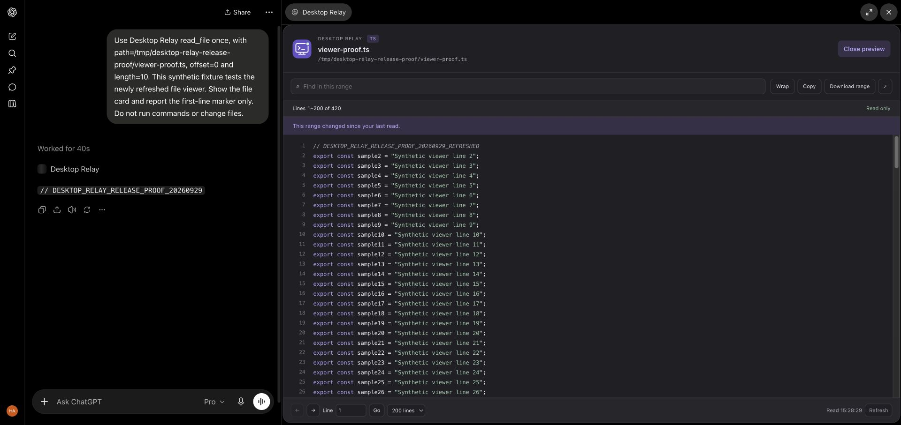

# File viewer

`read_file` advertises a relay-owned MCP Apps resource. It opens as a compact file
card. Expanding the card reads up to 200 lines through `browse_relay_file`; opening
or mounting a collapsed card performs no additional file read.

The viewer supports local text and source files. Search covers the displayed
range. Copy and download include only that range. Previous, Next, and Go read
other ranges from disk. Refresh reads the same range again and reports whether
its text changed. Each range is a fresh read, not a snapshot of the entire file;
different pages can represent different file versions if another process edits it.
There is no automatic refresh and no editing control. Media remains available in
the original `read_file` result; the new text viewer does not render media.

## Boundaries

- The normal model-facing `read_file` result and retained-result paging continue
  to work. The file card does not replace text that the model needs to reason.
- `browse_relay_file` is advertised with `ui.visibility: ["app"]`. Its `content`
  contains a short completion message; the displayed text lives in `_meta.fileView`.
  The viewer never calls `updateModelContext` or sends selected text to the model.
- Visibility is a host hint, not authorization. The server checks the authenticated
  principal's `read_file` grant on every preview call. It validates the range and
  invokes the existing shared Desktop Commander client once. Desktop Commander's
  path checks remain authoritative. The helper does not read the filesystem directly.
- Preview calls accept only an absolute local path, an integer offset, and 1–200
  lines. Tail reads are limited to 200 lines. Responses over 256 KiB are rejected
  with an explicit message. URLs and unrecognized arguments are rejected.
- Source is inserted using text nodes or highlight.js's escaped token markup.
  File contents are never executed as HTML or scripts.
  The resource declares no external connection or asset domains.
- Audits record request source and byte counts, never file paths or file content.
  Old calls with no source field remain unclassified in the dashboard. These are
  payload measurements; the relay cannot report ChatGPT's actual token usage.

## Design choice

Two shapes were considered: modify Desktop Commander's bundled viewer, or own a
small read-only resource in the relay. The relay-owned resource avoids coupling
to the upstream widget's internal selectors, editing behavior, and eager rereads.
It reuses the upstream file reader, existing session authorization, and MCP Apps
SDK. It adds no listener or proxy.

The browser bundle is checked in so the daemon still runs without a build step.
After changing `src/file-viewer-client.js`, run `pnpm build:viewer` and commit the
generated `src/file-viewer.bundle.js`. The MCP Apps SDK, highlight.js, and esbuild
are development dependencies only. HTML and CSS are loaded directly from `src/`.

## Verification

`node --test test/file-viewer.test.ts` starts an isolated Desktop Commander child
and tests actual MCP sessions: exact Unicode ranges, end-of-file and tail reads,
changed content, invalid inputs, denied grants/resources, component-only payloads,
icon metadata, and executable resource JavaScript. No production child is restarted.

Browser acceptance: open a `read_file` card, verify no preview request before
expanding, then test Next, Previous, Go, search, wrapping, copy/download, and Refresh
after a fixture edit. Check that a failed refresh retains the previous successful
range with an error message. Check the same resource in ChatGPT after refreshing
the connector's tool metadata; local browser acceptance alone does not establish
ChatGPT host acceptance.

Local acceptance passed with a real Desktop Commander child and the official
MCP Apps host bridge in Chrome: collapsed card, exact first/last ranges, disabled
Next at EOF, Go/Previous, search, wrapping, copy, and a downloaded 200-line range
matching the source. Refresh detected an edited range. Removing the fixture made
Refresh report an error while retaining the previous content. Source containing
script markup remained inert. Expanded view returned to inline mode. The README
screenshot uses that synthetic fixture. In the protocol fixture, 10,491 bytes of
file text stayed in component metadata; model-facing `content` was 94 JSON bytes.

The isolated relay passed all 17 acceptance checks. Existing result paging
recovered 48,065 file bytes and 48,325 command bytes exactly; the scratch command
executed once. Nine automated tests and shell checks passed after a frozen pnpm
install. These checks do not establish that the new UI has been activated in a
particular ChatGPT connection.

## ChatGPT activation check

On September 29, 2026, the running v0.2.0 candidate passed a fresh ChatGPT check
after **Refresh tools** on the existing app. A synthetic 420-line TypeScript file
opened in the new viewer with its icon. Next reached ranges 201–400 and 401–420,
with Next disabled at EOF. Go returned to line 1. After the fixture changed on
disk, Refresh displayed the new marker and reported that the range changed.
The original model response retained its earlier marker.

The saved app initially contained old tool descriptions. Refreshing tools and
reloading its details replaced them with the compact catalogue, including
`read_relay_result` and `browse_relay_file`. Updating the daemon alone did not
update ChatGPT's saved definitions. Menu-icon display remains host-dependent.
